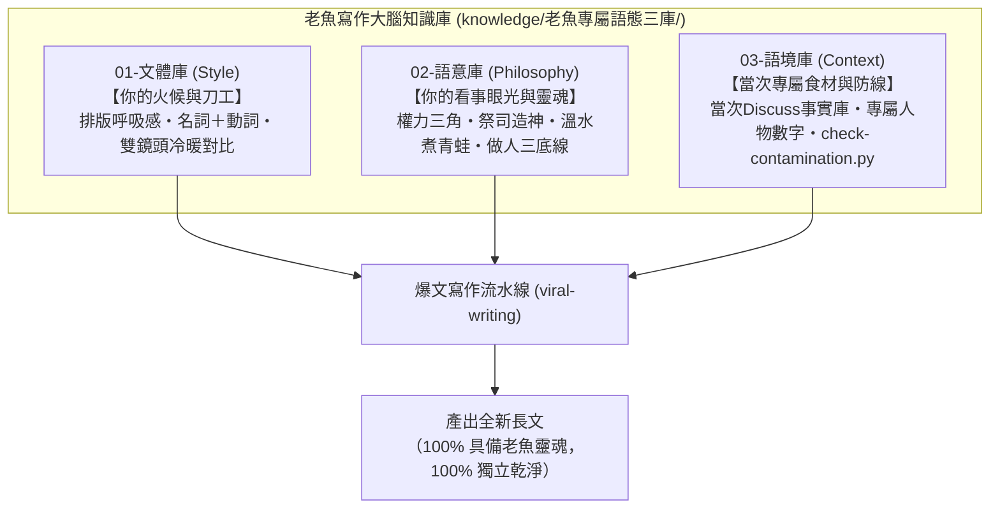

# 老魚專屬語態大腦：三庫架構總覽（SSOT）

> 本目錄為老魚深度寫作的最高準則（Single Source of Truth），將寫作大腦徹底解耦為三個獨立抽屜，從根源杜絕跨篇故事污染。

---

## ▋ 三庫職責分工架構

---

## ▋ 寫作調用口訣

1. **借「文體庫」的刀工**：節奏要快、每段 1~3 句、大量使用名詞＋動詞的身體應激反應。
2. **借「語意庫」的心法**：看穿利益博弈背後的權力三角與造神，結尾永遠回到做人三大底線收傘。
3. **守「語境庫」的食材**：只吃當次 Discuss 盤點出來的最新事實，嚴禁把上一篇文章的舊菜（倒賠 80 萬、換百鈔、日本公務員）端上桌！
